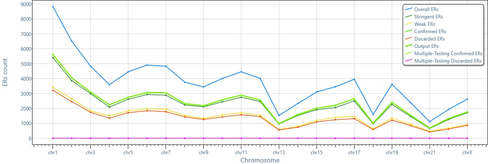

# About

ChIP-seq technology is nowadays routinely used to identify DNA-protein interaction and chromatin modifications,
while DNase-seq is one of the most prominent methods to identify open chromatin regions. The output of both 
these techniques is a list of enriched regions, whose statistical significance is usually quantified with a
score (p-value). Typically, only enriched regions whose significance is above a user-defined threshold (e.g.
`p-value < 10^-8`) are considered. However, the simultaneous presence of an enriched region in replicate 
experiments would justify a local decrease of the stringency criterion, leveraging on the principle that 
repeated evidence is compensating for weak evidence.

MuSERA is a tool that optimally implements multiple-sample enriched region analysis, with a user-friendly graphical
interface. It jointly analyzes the enriched regions of multiple replicates, distinguishing between biological and
technical replicates, and accepting user-defined parameters: weak (`T^w`) and stringent (`T^s`) significance 
thresholds, combined significance threshold (`γ`), minimum number of replicates where the overlapping enriched 
regions should be present(`C`), and multiple-testing correction threshold (`α`).  The output of MuSERA consists 
in sample-specific lists of enriched regions, which account for the presence of replicates. These lists can be 
used to generate several automatic plots and visualized in a genome browser integrated in the tool. The enriched
regions are classified as stringent-confirmed, stringent-discarded, weak-confirmed and weak-discarded based on the
combined statistical significance obtained over replicates, evaluated with the Fisher's method. 

Given reference annotations, MuSERA supports the positional analysis of the enriched regions in each output list,
with respect to the reference annotations, and complements it with illustrative plots. Results are exported in 
standard BED files and/or in an XML file with detailed information about each of the regions; furthermore, each
plot can be exported as a high resolution image.

The goal of MuSERA is to facilitate the investigation of results following different parameter choices by 
integrating data visualization in a genome browser, functional analysis with user-chosen annotation, and 
nearest neighbor search. Additionally, MuSERA provides means of combining a large collection of replicates
in different sessions (independently from each other) in a batch process defined using simplified XML structure.
This feature facilitates the analysis of a large collection of samples, each with its own parameters, with no
requirement of coding/scripting knowledge.

### Citing MuSERA
If you use or extend MuSERA in your published work, please cite the following publication:

    Vahid Jalili, Matteo Matteucci, Marco J. Morelli, and Marco Masseroli 
    MuSERA: Multiple Sample Enriched Region Assessment
    Brief Bioinform first published online March 24, 2016 doi:10.1093/bib/bbw029.

# Download and Documentation 
All releases of MuSERA are available for [download from this page](https://github.com/Genometric/MuSERA/tree/master/Downloads).  
A complete MuSERA tutorial is available at [this link](http://www.bioinformatics.deib.polimi.it/genomic_computing/MUSERA/packages/MuSERAUserManual.pdf).

### Screen shots 

**Interactive (left) and Batch (right) running modes of MuSERA.**

**Overview plot of combining evidence in multiple replicates.**

**Interactive genome browser integrated in MuSERA** with zoom-in, zoom-out and pan functionalities to see how enriched regions on replicates are evaluated, and how they co-localize with known genomic features such as promoter regions.

**Single-click p-value distribution plot** to easily compare the distribution of enriched region p-values across replicates.

**Distribution of enriched region p-values in different computed enriched region sets** 

**Nearest neighbor analysis** allows checking how close the enriched regions of different computed sets are, e.g., in this example, stringent-confirmed enriched regions are mainly very close to each other.

**Distribution of combined evidence in a single-click!**

**Fast and easily customizable functional analysis integrated in MuSERA**: allows plotting the distances between enriched regions from different sets and known genomic features.

**MuSERA provides all the information chromosome-wide**: e.g., an overview of the results of the analysis of different sets of enriched regions stratified by chromosome.

