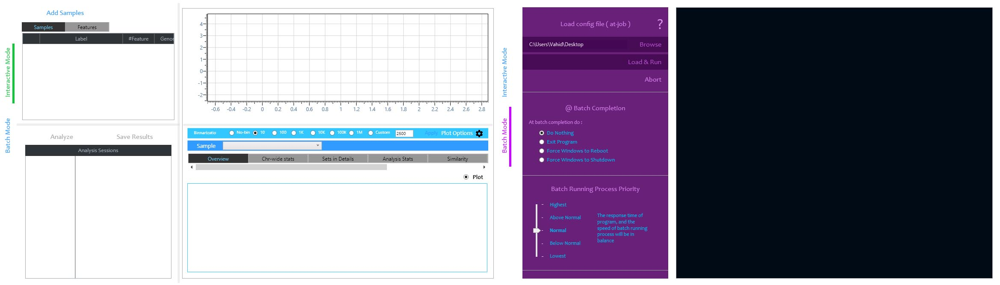
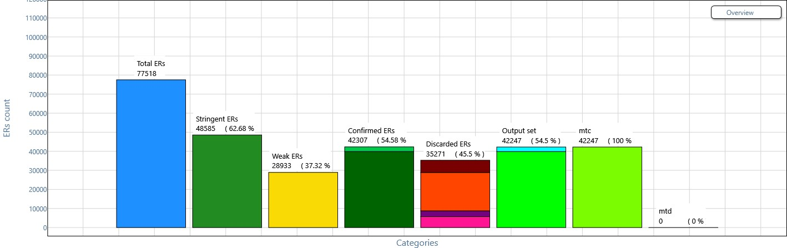
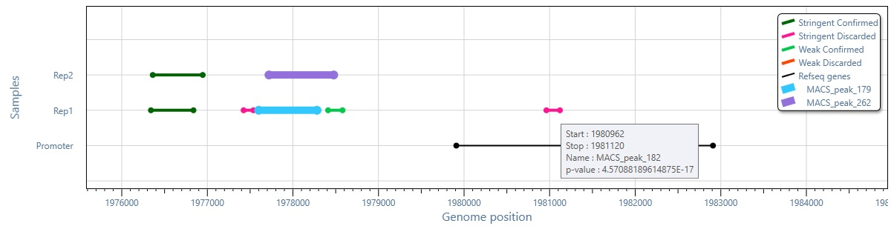
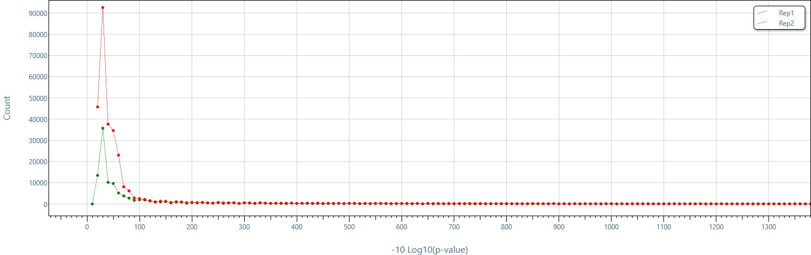
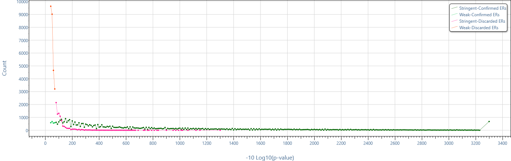
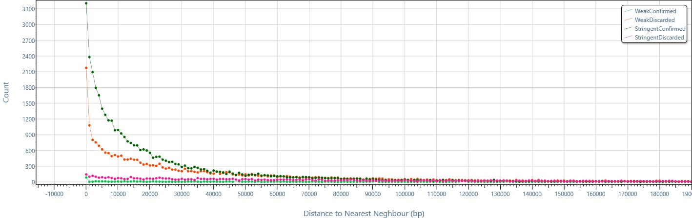
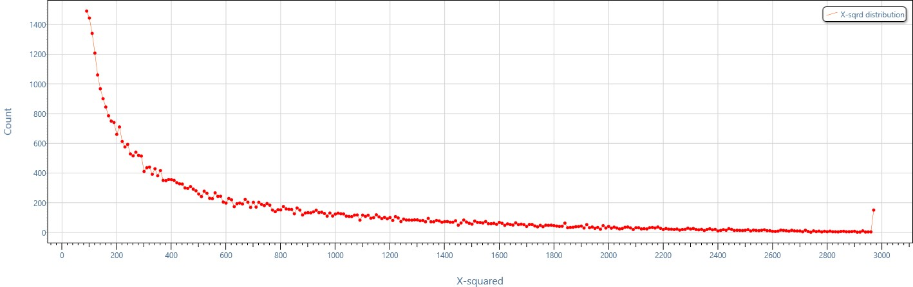
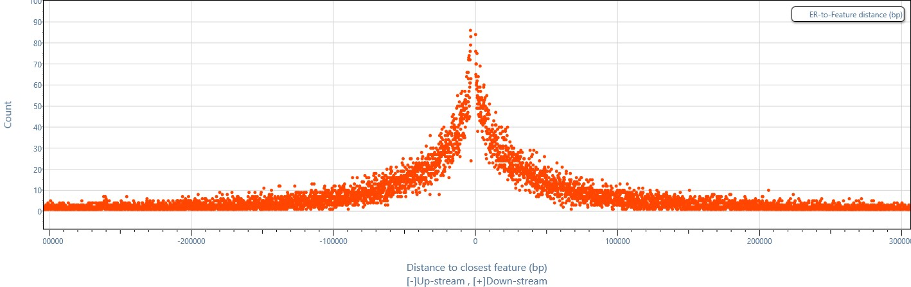
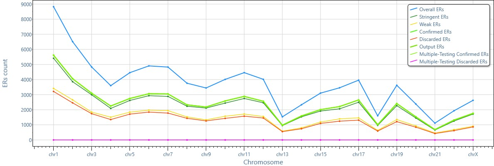

# About

ChIP-seq technology is nowadays routinely used to identify DNA-protein interaction and chromatin modifications, while DNase-seq is one of the most prominent methods to identify open chromatin regions. The output of both these techniques is a list of enriched regions, whose statistical significance is usually quantified with a score (p-value). Typically, only enriched regions whose significance is above a user-defined threshold (e.g. p-value < 10^^-8^^) are considered. However, the simultaneous presence of an enriched region in replicate experiments would justify a local decrease of the stringency criterion, leveraging on the principle that repeated evidence is compensating for weak evidence.

MuSERA is a tool that optimally implements multiple-sample enriched region analysis, with a user-friendly graphical interface. It jointly analyzes the enriched regions of multiple replicates, distinguishing between biological and technical replicates, and accepting user-defined parameters: weak (T^^w^^) and stringent (T^^s^^) significance thresholds, combined significance threshold (γ), minimum number of replicates where the overlapping enriched regions should be present(C), and multiple-testing correction threshold (α).  The output of MuSERA consists in sample-specific lists of enriched regions, which account for the presence of replicates. These lists can be used to generate several automatic plots and visualized in a genome browser integrated in the tool. The enriched regions are classified as stringent-confirmed, stringent-discarded, weak-confirmed and weak-discarded based on the combined statistical significance obtained over replicates, evaluated with the Fisher's method. 

Given reference annotations, MuSERA supports the positional analysis of the enriched regions in each output list, with respect to the reference annotations, and complements it with illustrative plots. Results are exported in standard BED files and/or in an XML file with detailed information about each of the regions; furthermore, each plot can be exported as a high resolution image.

The goal of MuSERA is to facilitate the investigation of results following different parameter choices by integrating data visualization in a genome browser, functional analysis with user-chosen annotation, and nearest neighbor search. Additionally, MuSERA provides means of combining a large collection of replicates in different sessions (independently from each other) in a batch process defined using simplified XML structure. This feature facilitates the analysis of a large collection of samples, each with its own parameters, with no requirement of coding/scripting knowledge.

For more information, you may visit [MuSERA homepage](http://www.bioinformatics.deib.polimi.it/genomic_computing/MUSERA/)

# Authors
* [Vahid Jalili](http://home.deib.polimi.it/jalili/)
* [Matteo Matteucci](http://chrome.ws.dei.polimi.it/index.php/Matt%27s_Home_Page)
* [Marco Morelli](http://www.iit.it/en/people/marco-morelli.html)
* [Marco Masseroli](http://www.bioinformatics.polimi.it/masseroli/masseroli.htm)

# Contacts
* Vahid Jalili: **vahid** _DOT_ **jalili** _AT_ **polimi** _DOT_ **it**

### Citing MuSERA
If you use or extend MuSERA in your published work, please cite the following publication:
{""}
Vahid Jalili, Matteo Matteucci, Marco J. Morelli, and Marco Masseroli 
[MuSERA: Multiple Sample Enriched Region Assessment](http://bib.oxfordjournals.org/content/early/2016/03/23/bib.bbw029.abstract) 
Brief Bioinform first published online March 24, 2016 doi:10.1093/bib/bbw029.
{""}
{""}

# Screen shots 

**Interactive (left) and Batch (right) running modes of MuSERA.**

**Overview plot of combining evidence in multiple replicates.**

**Interactive genome browser integrated in MuSERA** with zoom-in, zoom-out and pan functionalities to see how enriched regions on replicates are evaluated, and how they co-localize with known genomic features such as promoter regions.

**Single-click p-value distribution plot** to easily compare the distribution of enriched region p-values across replicates.

**Distribution of enriched region p-values in different computed enriched region sets** 

**Nearest neighbor analysis** allows checking how close the enriched regions of different computed sets are, e.g., in this example, stringent-confirmed enriched regions are mainly very close to each other.

**Distribution of combined evidence in a single-click!**

**Fast and easily customizable functional analysis integrated in MuSERA**: allows plotting the distances between enriched regions from different sets and known genomic features.

**MuSERA provides all the information chromosome-wide**: e.g., an overview of the results of the analysis of different sets of enriched regions stratified by chromosome.

